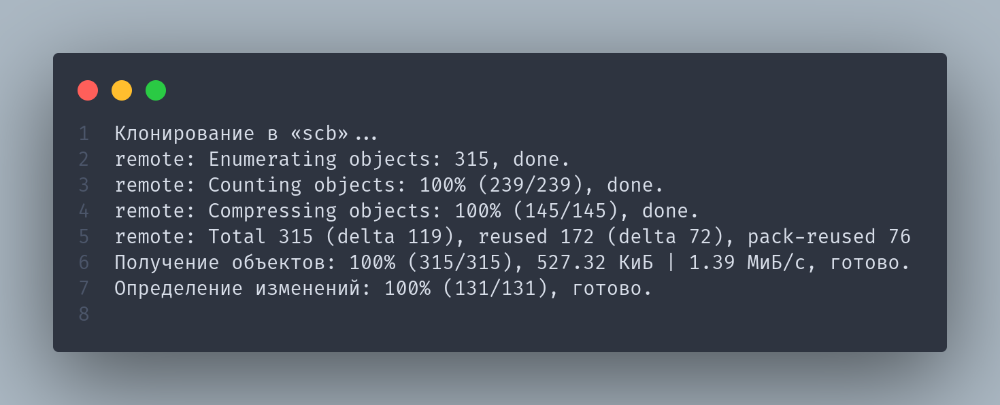
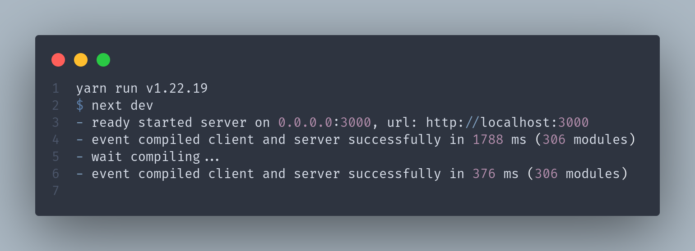

# SCB HACKATHON


## Hi, friend. Today I will tell you how to start this "project".
Follow all the commands in order. kk? =)

ps. technologies used:
- Next13 appdir
- Tailwind
- Headlessui
- Tabler
- Eslint
- Framer-motion
- Tailwindcss
- Typescript
- Zustand
- ...

## Option #1

```
➜ git clone https://github.com/AiorNerok/scb.git
```
you should see it



then run these commands


and you should see it



If everything is alright. follow the link [localhost:3000](http://localhost:3000)


## Option #2 

```
➜ git clone https://github.com/AiorNerok/scb.git
➜ cd scb
➜ docker build -t nextjs-docker .
➜ docker build -t nextjs-docker .
➜ docker run -p 3000:3000 nextjs-docker
```
If everything is alright. follow the link [localhost:3000](http://localhost:3000)

# Now you can poke wherever you want

## Further a little about what is implemented, and where you can poke

### What is implemented && Clickable links
- Adding a Resume
- Adding Jobs
- You can share a link so that the applicant fills out the profile
- Transferring a vacancy to the archive and back (adventure for 20 minutes, entered and exited)
- Share a link to the vacancy constructor